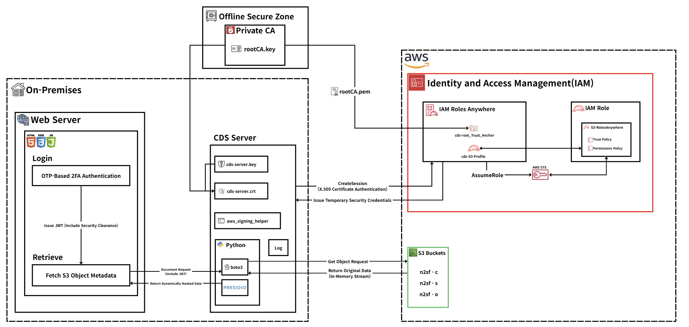
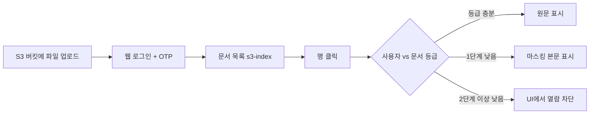
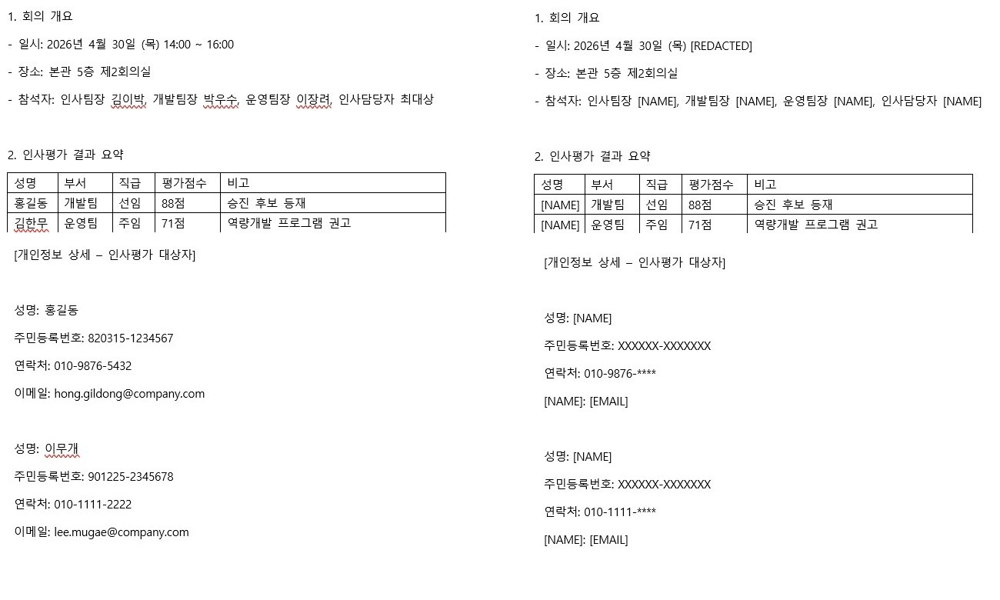

<div align="center">

# Access CDS for N2SF
</div>

N2SF 환경에서 보안 등급(C / S / O)에 따른 문서 접근·전송을 제어하고, 민감정보를 탐지·마스킹하는 **Cross Domain Solution(CDS)** 기반 시스템입니다.

---

## 프로젝트 개요
N2SF 환경에서는 정보의 민감도와 사용자 권한에 따라 문서 접근 범위를 구분하고, 보안 정책에 맞는 정보 유통 체계를 적용할 필요가 있습니다. 

본 프로젝트는 이러한 환경에서 **등급별 접근 통제**와 **안전한 문서 제공 방식**을 구현하는 것을 목적으로 Access CDS를 개발하였습니다.

---

## 시스템 아키텍처

<!-- 이미지: 전체 시스템 아키텍처 다이어그램
     - 사용자 / 웹 브라우저 (localhost:3000)
     - Express 웹 서버: 로그인·OTP, CDS API 프록시 (/api/cds)
     - FastAPI CDS (localhost:8000): JWT, 마스킹·전송 정책, 감사 로그
     - Oracle Database: users, OTP
     - AWS S3: 등급별 버킷 (n2sf-c / n2sf-s / n2sf-o)
     - CDS ↔ S3: IAM Roles Anywhere (로컬 ~/.aws/config, 인증서는 저장소 미포함)
     - 흐름: 로그인 → JWT → s3-index → access/transfer
-->



| 구성 요소 | 역할 |
|-----------|------|
| **Web Server** | 사용자 인증, JWT 발급, 문서 요청 전달 |
| **CDS Server** | 접근 통제, 하향 변환, S3 연동, 감사 로그 |
| **Private CA** |CDS 인증서 및 신뢰 체계 관리 |
| **IAM Roles Anywhere** | S3 접근용 임시 자격 증명 발급 |
| **AWS S3** | 등급별 문서 저장 |


---

## 주요 기능

### 보안 등급 기반 접근 제어

- 등급: C (Confidential) > S (Sensitive) > O (Open)
- 조회: 사용자 등급이 문서 등급보다 낮으면 마스킹된 본문 반환 
- 전송: 등급 간 전송 규칙 적용 (상향·하향 제한, S→O 시 강제 마스킹 등)

### S3 통합 문서 관리

- C / S / O 버킷 객체를 통합 목록으로 제공 (`GET /documents/s3-index`)
- `s3r1.*` 참조 ID로 조회·전송 API 연동

### 민감정보 탐지 및 마스킹

- Presidio 기반 PII 탐지 (주민등록번호, 전화번호, 이메일 등)
- 텍스트 조회·전송 시 정책에 따른 마스킹
- Word(.docx) 단락 단위 마스킹 다운로드

### 사용자 인증 및 감사

- Oracle 기반 ID/비밀번호 로그인 + TOTP(OTP)
- 문서 조회·전송·거부 이벤트 감사 로그 (`cds/logs/audit.jsonl`)

---

## 프로젝트 구조

```
Access CDS for N2SF
├── cds/                        # CDS API (FastAPI)
│   ├── main.py                 # 앱 진입점, REST 라우트
│   ├── auth.py                 # JWT 발급·검증
│   ├── access_service.py       # 문서 조회 (S3 참조, PoC 샘플)
│   ├── transfer_service.py     # 문서 전송 정책·처리
│   ├── filter_engine.py        # Presidio 마스킹 엔진
│   ├── docx_mask.py            # docx 마스킹·다운로드
│   ├── s3_reader.py            # S3 읽기 (IAM Roles Anywhere)
│   ├── s3_inventory.py         # 버킷 목록 통합, s3r1 참조 ID
│   ├── logger.py               # 감사 로그 기록
│   ├── models.py               # Pydantic 모델
│   ├── requirements.txt
│   └── .env.example
|
├── web/                        # 웹 프론트·BFF
│   ├── server.js               # Express, Oracle 로그인, CDS 프록시
│   ├── package.json
│   └── public/
│       ├── index.html
│       ├── login_otp.html      # 로그인·OTP
│       ├── main.html           # S3 문서 목록·조회
│       └── style.css
|
└── sql/                        # Oracle 스키마·시드
    ├── setup_oracle_user.sql   # C##cds 사용자 생성 (관리자 실행)
    ├── cds_project1.sql        # 테이블·초기 데이터
    └── seed_data_only.sql      # 데이터만 재삽입
```


---

## 실행 방법

### 사전 요구 사항

- Python 3.10+, Node.js 18+
- Oracle Database (스크립트는 `XEPDB1` PDB 기준)
- AWS S3 버킷 3개, IAM Roles Anywhere 로컬 프로필 (`~/.aws/config`)

### 1. Oracle

관리자로 `sql/setup_oracle_user.sql` 실행 후, `C##cds` 계정으로 `sql/cds_project1.sql` 실행.

### 2. CDS API

```bash
cd cds
python -m venv .venv
.venv\Scripts\activate
pip install -r requirements.txt
copy .env.example .env
uvicorn main:app --reload --port 8000
```

### 3. Web

```bash
cd web
npm install
set CDS_JWT_SECRET=<cds/.env와 동일>
set ORACLE_USER=C##cds
set ORACLE_PASSWORD=<비밀번호>
set ORACLE_CONNECT_STRING=localhost:1521/XEPDB1
npm start
```

브라우저: `http://localhost:3000`

### PoC 샘플 계정

| user_id | password | role (JWT level) | 설명 |
|---------|----------|------------------|------|
| admin | 1234 | C | 최고 등급, C/S/O 문서 원문 열람 |
| staff1 | 1234 | S | S/O 원문, C 문서는 마스킹 열람 |
| user1 | 1234 | O | O 원문, S/C는 마스킹 또는 UI 차단 |

---

## 동작 흐름 및 워크플로우 예시

전체 흐름은 **S3에 문서 업로드 → 웹 로그인 → 목록에서 행 클릭 → CDS가 등급에 따라 원문/마스킹 반환** 순서입니다.



### 1. S3에 테스트 문서 넣기

등급별 버킷(기본값: `n2sf-c`, `n2sf-s`, `n2sf-o`)에 객체를 업로드합니다. **어느 버킷에 넣느냐가 문서 등급(C/S/O)이 됩니다.**

| 문서 등급 | 업로드 버킷 (기본) | 예시 객체 키 |
|-----------|-------------------|--------------|
| C | `n2sf-c` | `sample/confidential-report.txt` |
| S | `n2sf-s` | `sample/sensitive-plan.txt` |
| O | `n2sf-o` | `sample/public-notice.txt` |

마스킹 확인용으로 본문에 아래와 같은 **가짜 PII**를 넣은 `.txt` 또는 `.docx`를 권장합니다.

```text
담당자 홍길동, 연락처 010-1234-5678, 주민등록번호 990101-1234567, 이메일 test@example.com
```

업로드 예시 (AWS CLI, 프로필명은 환경에 맞게 변경):

```bash
aws s3 cp ./confidential-report.txt s3://n2sf-c/sample/confidential-report.txt --profile my-cds-profile
aws s3 cp ./sensitive-plan.txt      s3://n2sf-s/sample/sensitive-plan.txt      --profile my-cds-profile
aws s3 cp ./public-notice.txt       s3://n2sf-o/sample/public-notice.txt       --profile my-cds-profile
```

CDS와 Web 서버를 재시작할 필요는 없습니다. 목록은 S3를 매 요청마다 조회합니다.

### 2. 로그인 (OTP)

1. 브라우저에서 `http://localhost:3000` 접속
2. 샘플 계정으로 로그인 (예: `user1` / `1234`)
3. **최초 로그인**이면 QR 코드가 표시됩니다. Google Authenticator 등에 등록한 뒤 OTP 6자리 입력
4. 인증 성공 시 JWT가 저장되고 `main.html`(문서 조회)로 이동

OTP를 다시 등록하려면 Oracle에서 해당 사용자의 `otp_secret`을 `NULL`로 초기화한 뒤 재로그인합니다 (`cds_project1.sql` 참고).

### 3. 문서 목록에서 등급·열람 상태 확인

`문서 조회` 화면은 CDS `GET /documents/s3-index` 결과를 표시합니다.

| 목록 열람 칸 | 의미 |
|--------------|------|
| 열람 | 사용자 등급 ≥ 문서 등급 → 클릭 시 **원문** (민감정보 포함 가능) |
| 요청 | 문서 등급이 사용자보다 1단계 높음 → 클릭 시 CDS가 **마스킹된 본문** 반환 |
| 제한 | 2단계 이상 높음 (예: O 사용자 + C 문서) → **클릭해도 API 호출 없이** 차단 메시지 |

### 4. 마스킹 동작 확인 시나리오

아래는 **C 등급 문서를 `n2sf-c`에 올려 둔 경우** 예시입니다.

| 로그인 계정 | role | C 문서 목록 상태 | 행 클릭 시 결과 |
|-------------|------|------------------|----------------|
| admin | C | 열람 | 원문 
| staff1 | S | 요청 | 마스킹본 
| user1 | O | 제한 | "접근 권한이 없습니다" |

**S 등급 문서(`n2sf-s`)** 를 올린 뒤 `user1`(O)으로 로그인하면 목록은 **요청**, 클릭 시 **마스킹본**이 보이면 정상입니다.

**O 등급 문서(`n2sf-o`)** 는 세 계정 모두 목록에서 **열람**이며, 클릭 시 원문이 표시됩니다.

<!-- 이미지: 워크플로우 캡처 (선택)
     1) S3 콘솔 또는 CLI 업로드 화면
     2) 로그인·OTP 화면
     3) 문서 목록 (열람/요청/제한 배지)
     4) 동일 문서를 O 계정 vs S 계정으로 열었을 때 마스킹 전·후 비교
-->

### 5. Word(.docx) 문서인 경우

- `n2sf-*` 버킷에 `.docx`를 올리면 목록에 표시됩니다.
- **요청** 또는 **열람** 상태에서 행을 클릭하면 텍스트 미리보기가 열립니다.
- 마스킹이 적용된 경우 **마스킹 Word 다운로드** 버튼으로 `GET /access/{doc_id}/download-masked` 결과를 받을 수 있습니다.

### 6. API로 직접 확인 (선택)

Swagger: `http://localhost:8000/docs`

1. `POST /demo/token?user_id=test&user_level=O` 로 토큰 발급
2. Authorize에 Bearer 토큰 입력
3. 목록에서 복사한 `doc_id`(`s3r1.`로 시작)로 `GET /access/{doc_id}` 호출
4. `masked_count` > 0 이면 마스킹이 적용된 것입니다.

인메모리 샘플만 빠르게 보려면 `doc_id`에 `C-001`, `S-001`, `O-001`을 사용할 수 있습니다 (S3 없이 동작).

### 7. 감사 로그 확인

조회·전송 시 `cds/logs/audit.jsonl`에 이벤트가 쌓입니다. C 등급 사용자로 `GET /audit/logs`를 호출하거나 파일을 직접 열어 확인합니다.

---

## 마스킹 예시


<!-- 이미지: 테스트 시나리오 표, 마스킹 전·후 비교, S3 연동 성공 화면, 감사 로그 예시 등 -->


---

## 팀원 및 역할

<table align="center" style="border-collapse: collapse; border: none;">
  <tr align="center" valign="top">
    <td width="150" style="padding: 10px; border: none;">
      <a href="https://github.com/poatan2" target="_blank">
        
      </a><br>
      <a href="https://github.com/poatan2" target="_blank" style="text-decoration: none; color: inherit;">
        <span style="font-size: 16px; font-weight: bold; display: block; margin-top: 8px;">홍태경</span>
      </a>
      <span style="font-size: 13px; color: #666; display: block; margin-top: 4px;">Leader</span>
    </td>
    <td width="150" style="padding: 10px; border: none;">
      <a href="https://github.com/LeeDoHyup" target="_blank">
        
      </a><br>
      <a href="https://github.com/LeeDoHyup" target="_blank" style="text-decoration: none; color: inherit;">
        <span style="font-size: 16px; font-weight: bold; display: block; margin-top: 8px;">이도협</span>
      </a>
    </td>
    <td width="150" style="padding: 10px; border: none;">
      <a href="https://github.com/Park123r" target="_blank">
        
      </a><br>
      <a href="https://github.com/Park123r" target="_blank" style="text-decoration: none; color: inherit;">
        <span style="font-size: 16px; font-weight: bold; display: block; margin-top: 8px;">박윤하</span>
      </a>
    </td>
    <td width="150" style="padding: 10px; border: none;">
      <a href="https://github.com/potatouni" target="_blank">
        
      </a><br>
      <a href="https://github.com/potatouni" target="_blank" style="text-decoration: none; color: inherit;">
        <span style="font-size: 16px; font-weight: bold; display: block; margin-top: 8px;">김유은</span>
      </a>
    </td>
  </tr>
</table>